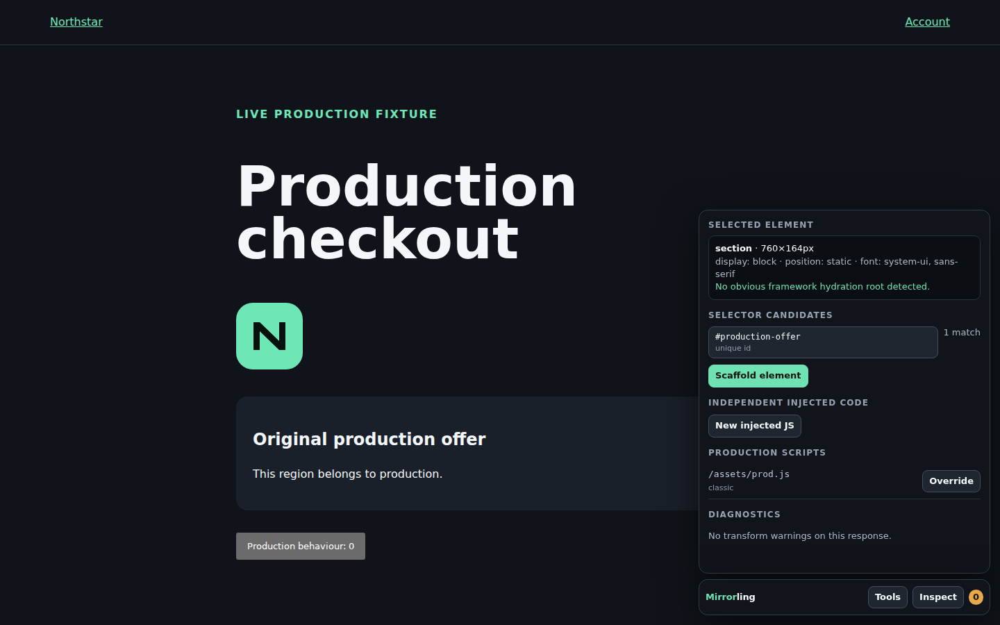

  

<h1 align="center">Mirrorling</h1>

<strong>The production site, under temporary management.</strong>

Borrow the living page. Change the interesting bit. Give it back.

Most staging sites are lies with deployment pipelines. They begin as respectable copies of production and end as wax museums: old markup, old behaviour and a mounting collection of explanations. The test passes. Reality, displaying its usual lack of team spirit, does not.

Mirrorling begins from a less consoling premise: if the page under test is not the page users are using, fidelity has already been surrendered.

Give it any authorised production URL. Mirrorling serves that living site through an independent staging origin, under its own SSL certificate, while production continues to supply the page, assets, styles, scripts and ordinary behaviour. A scenario may seize only the surfaces under test. When its work is finished, the same browser tab returns to production by ordinary client-side navigation.

No production-server alteration. No backend state exchange. No shared certificate. No YAML clerisy.

The bird is not decoration. Its feathers are browser panes, its tail is a patch cable, and the mint panel is the one fragment staging is permitted to possess. It borrows, intervenes and leaves. That is the whole constitutional settlement.

**Release candidate:** `1.2.0-rc.1` · **Runtime:** Node.js 22.13+ · **Licence:** MIT

## First intervention, five minutes

1. Install with `npm ci`.
2. Start with `npm run dev -- https://production.example/checkout`.
3. Open the staging URL printed in the terminal.
4. Click **Inspect**, then click the production element you mean to change.
5. Choose **Scaffold element** and edit the generated Handlebars, CSS or JavaScript.

Save the file. Mirrorling reloads the page with a clean production-script lifecycle. The production URL may be any authorised HTTP or HTTPS origin and may include the path at which the exercise should begin.

For the self-contained tour, run `npm run demo`, visit `http://127.0.0.1:4312/checkout`, then choose **Checkout variant** from `/__bench`. For a disposable mirror, run `npm run mirror -- https://production.example/any/path`.

## Its jurisdiction is deliberately narrow

> **No selected scenario means the mirror.**

In a clean browser session, an ordinary staging URL with no bench query, request header or retained scenario cookie selects the empty baseline. Production HTML, CSS, assets, scripts and APIs pass through with only the adaptation required to behave on the staging origin. Mirrorling promises behavioural fidelity, not a theological devotion to identical bytes.

Choosing a scenario stores a staging-only cookie so it survives navigation. Return explicitly with `?__bench_scenario=baseline`; the control parameter is removed from the visible URL immediately.

The incoming request cannot nominate another upstream. The operator fixes one production origin through the command line, JSON or `BENCH_UPSTREAM_ORIGIN`. An open proxy would be easier to write and indefensible to publish.

A scenario may claim:

- **An element:** replace, insert around, amend or remove production markup with a Handlebars template.
- **Independent code:** inject new JavaScript or CSS beside the untouched production application.
- **A production script:** replace, prepend or append a matched production JavaScript response.
- **A route:** return a staged API fixture, add deliberate latency or exercise an unhappy path.
- **A boundary:** conclude the staged portion and return the browser to an allowlisted production destination.

Everything unclaimed remains production’s affair. If that sounds doctrinaire, good. An experiment needs a boundary more urgently than it needs another option.

## Three kinds of JavaScript, three different facts

| Mode | What happens | Proper use |
| --- | --- | --- |
| Production JavaScript | Original production bytes execute untouched | Maximum behavioural fidelity |
| `injectedScripts` | New staging code executes alongside production | Test-flow logic, listeners, instrumentation and handover |
| `scriptOverrides` | A matched production resource is replaced, prepended or appended | Testing a changed bundle or intercepting production-owned behaviour |

An element override does not acquire global behaviour by stealth. An independent injection owns no DOM selector by implication. A production-script override acts on the resource request itself and removes stale integrity metadata from the corresponding script element. These distinctions are enforced in the model, where good intentions cannot quietly edit them later.

Independent code can run at `document-start`, `head-end`, `body-end`, `dom-ready` or `load`. It receives `window.__MIRRORLING__`, containing the selected scenario, both origins, scenario variables and the handover method.

## The inspector has eyes

Guessing selectors from DevTools is clerical superstition. Mirrorling inspects the page that actually arrived.

Inspection mode reports:

- ranked selectors favouring stable IDs, test/data attributes and accessible attributes;
- live match counts, tag, dimensions and relevant computed style;
- likely React, Vue, Angular and other hydration boundaries;
- production scripts present on the page;
- transformation diagnostics and selector-contract failures.

Scaffolding writes purpose-specific source files: `template.hbs`, `style.css`, independent JavaScript or a production-script override. It also writes a selector contract that can require a tag and match count. Production drift therefore becomes evidence instead of gossip. The default mismatch policy is `skip`, leaving that surface untouched; `apply` and `error` exist for experiments requiring sterner government.

Every matched element gives its template the original `html`, `outerHtml`, text, attributes and tag, along with request data, scenario variables, and both origins. Helpers include `text`, `html`, `attr`, `query`, `productionUrl`, `stagingUrl` and `json`. The complete grammar is in [bench.config.example.json](bench.config.example.json). It is JSON because whitespace should serve prose, not rule configuration.

## Leave production properly

The journey is intentionally finite:

**production behaviour → staged intervention → same-tab production return**

Injected code can call `window.__MIRRORLING__.handoff("continue-production", { state: { plan: "pro" } })`. Overlaid markup can instead use `data-bench-handoff` with optional `data-bench-state`.

Client state may travel by query, fragment or `window.name`; it may also travel nowhere. Only named `stateKeys` can cross, and every destination must remain on the configured production origin. [The optional client reader](examples/read-handoff-state.js) demonstrates consumption on the production side.

Staging and production may be unrelated sites with unrelated SSL certificates. A certificate authenticates an origin; it does not imprison a browser tab. Top-level navigation is the bridge. Production needs no handover endpoint, no server-side session transfer and no special server configuration.

## Netlify without dashboard theology

The repository includes a modern Fetch-style Netlify Function at `netlify/functions/bench.mts`, mounted on `/*` so the original path survives. `netlify.toml` declares the build and routing. User configuration remains JSON. The authored repository contains no YAML, and the hygiene gate guards the point with more conviction than a style guide.

To deploy:

1. Push the repository to GitHub and import it into Netlify.
2. Add `BENCH_UPSTREAM_ORIGIN` with **Functions** scope.
3. Commit the scenarios and generated override files intended for that deployment.
4. Deploy, visit `/__bench/health`, then open an ordinary production path.

`BENCH_PUBLIC_ORIGIN` is optional. Deploy previews and custom domains ordinarily derive their own current origin. A private instance can enable `server.access` and keep credentials in `BENCH_AUTH_USER` and `BENCH_AUTH_PASSWORD`.

Local development is the authoring room: inspector, scaffolding, live reload and WebSocket proxying. A Netlify deployment is an immutable test artefact. It mirrors, transforms, mocks and hands over, but it cannot write scaffold files at runtime. WebSocket upgrades receive `501`; transformed HTML and JavaScript remain bounded by `html.maxBytes` and the platform’s function limits.

The underlying platform facts are in Netlify’s [Functions API](https://docs.netlify.com/build/functions/api/), [Functions overview](https://docs.netlify.com/build/functions/overview/), [environment-variable guide](https://docs.netlify.com/build/functions/environment-variables/) and [file-based configuration guide](https://docs.netlify.com/build/configure-builds/file-based-configuration/).

## A release candidate, not an article of faith

`npm run rc:gate` is the publication gate. It runs repository hygiene, the Node-version check, TypeScript, 24 unit and integration tests, the compiled runtime smoke, a real Netlify production bundle, an invocation of the extracted function, a complete dependency audit and two Playwright Chromium journeys covering staged behaviour and same-tab production handover.

`npm run rc:gate:core` performs the non-browser portion. Deploy-preview inspection and the publication checklist live in [RELEASE.md](RELEASE.md). Security boundaries are explicit in [SECURITY.md](SECURITY.md); contribution rules are in [CONTRIBUTING.md](CONTRIBUTING.md). A green gate is evidence. It is not papal infallibility.

<strong>Command and configuration reference</strong>

| Command | Purpose |
| --- | --- |
| `npm run dev -- <production-url>` | Borrow production with inspection, scaffolding and live reload |
| `npm run mirror -- <production-url>` | Start a disposable baseline mirror |
| `npm run setup` | Create or update persistent JSON configuration |
| `npm start` | Build and run the saved Node setup |
| `npm run demo` | Run the self-contained production fixture and example |
| `npm run netlify:dev` | Run the Netlify development environment |
| `npm run netlify:build` | Build the real Netlify function bundle locally |
| `npm run check` | Type-check and run unit and integration tests |
| `npm run rc:gate` | Run the strict release-candidate gate |
| `npm run docs:capture` | Rebuild the inspector image used above |

Scenario selection is available from `/__bench`, `?__bench_scenario=<id>` or the `x-bench-scenario` request header. Internal endpoints are `/__bench`, `/__bench/health`, `/__bench/config`, `/__bench/events` and `/__bench/api/scaffold`; the last two exist only during local development.

Configuration precedence is environment, then `bench.config.json`, then the safe local default. The principal fields are `scenarios`, `elementOverrides`, `injectedScripts`, `injectedStyles`, `scriptOverrides`, `routeOverrides` and `handoffs`.

<strong>Honest limits</strong>

- Bot protection, device binding, origin validation, third-party cookie rules and hard-coded hosts can defeat proxying. Mirrorling adapts normal web behaviour; it has no writ against browser security.
- Separate origins cannot share cookies, Local Storage or IndexedDB. Handover moves only explicit, allowlisted client state.
- Service workers are suppressed by default because allowing a production worker to control staging would falsify the experiment with admirable efficiency.
- Direct production assets still need production CORS where the browser requires it. Images and media are generally easier than fonts, modules and scripts.
- Use Mirrorling only against systems you are authorised to proxy and test.

## Licence

MIT. See [LICENSE](LICENSE).

Mirrorling is designed to disappear. Production gets the last origin, the last word and, after handover, the last byte.
